# Value of Time

We calculate multiple scenarios **ignoring the Risk** while just considering the **Discrete Value of Time** for the following scenarios.

## 1. Calculating the Net Present Value with Discrete Compounding considering a Fixed Spot Rate

Execute using:

&nbsp;&nbsp;&nbsp;&nbsp;&nbsp;&nbsp;&nbsp;&nbsp;&nbsp;&nbsp; `g++ -pedantic-errors -std=c++11 pv_riskless_fcf_ft.cpp -o npv`

&nbsp;&nbsp;&nbsp;&nbsp;&nbsp;&nbsp;&nbsp;&nbsp;&nbsp;&nbsp; `./npv`

## ... Sample Output ... ##

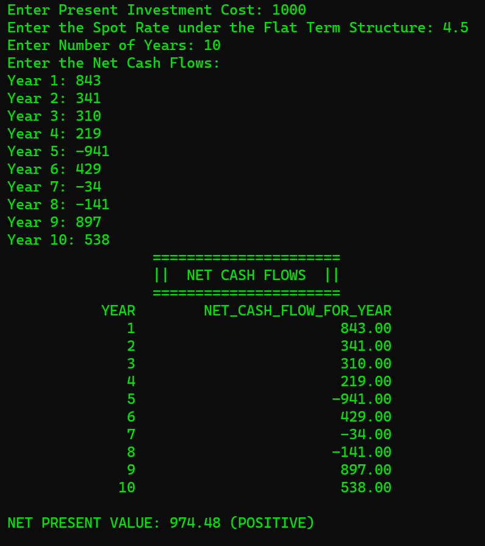

## 2. Calculating Perpetuity (Promise of a payment of a Fixed Amount X each period for the indefinite future with a Fixed Spot Rate) ##

Execute using:

&nbsp;&nbsp;&nbsp;&nbsp;&nbsp;&nbsp;&nbsp;&nbsp;&nbsp;&nbsp; `g++ -pedantic-errors -std=c++11 perpetuity.cpp -o perpetuity`

&nbsp;&nbsp;&nbsp;&nbsp;&nbsp;&nbsp;&nbsp;&nbsp;&nbsp;&nbsp; `./perpetuity 10000 7.5`

## ... Sample Output ... ##

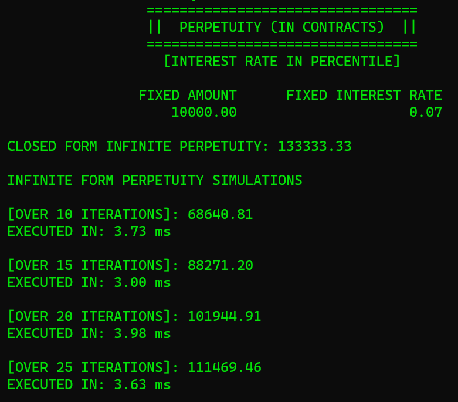

## ... ##

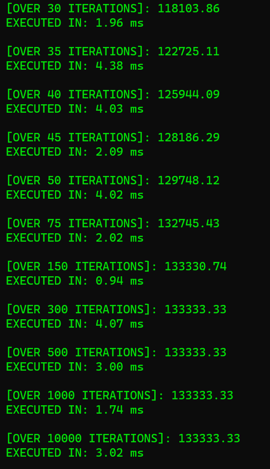

## 3. Calculating Growing Perpetuity (An infinite sequence of cashflows, where the payment the first year is Fixed Amount X and each consequent payment grows by a constant rate) ##

Execute using:

&nbsp;&nbsp;&nbsp;&nbsp;&nbsp;&nbsp;&nbsp;&nbsp;&nbsp;&nbsp; `g++ -pedantic-errors -std=c++11 growingperpetuity.cpp -o growingperpetuity`

&nbsp;&nbsp;&nbsp;&nbsp;&nbsp;&nbsp;&nbsp;&nbsp;&nbsp;&nbsp; `./growingperpetuity 10000 5.5 2.5`

## ... Sample Output ... ##

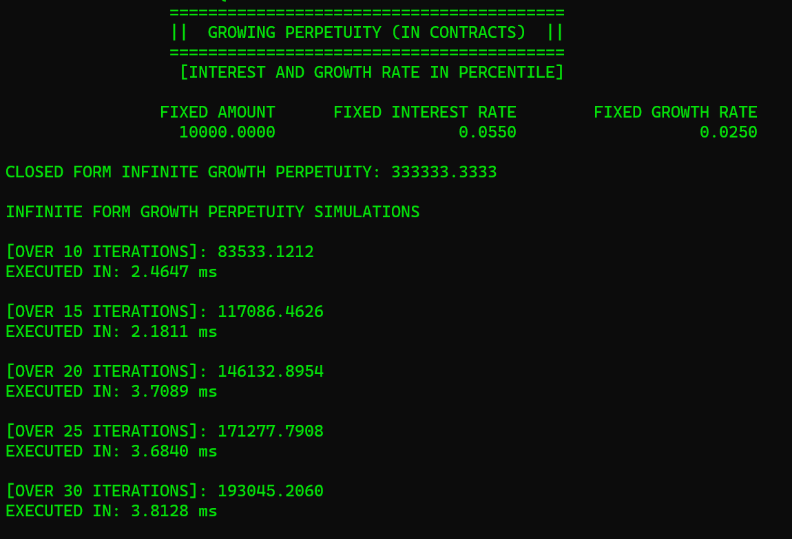

## ... ##

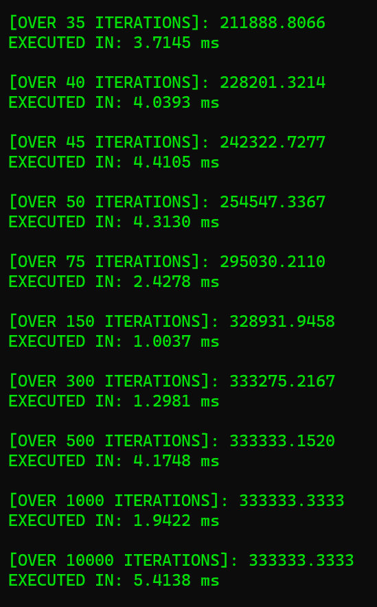

## 4. Calculating Annuity (A sequence of Cash Flows for a given number of years, say T periods into the future, while considering an Annuity paying a Fixed Amount X each period with a Spot Fixed Rate r)

Execute using:

&nbsp;&nbsp;&nbsp;&nbsp;&nbsp;&nbsp;&nbsp;&nbsp;&nbsp;&nbsp; `g++ -pedantic-errors -std=c++11 annuity.cpp -o annuity`

&nbsp;&nbsp;&nbsp;&nbsp;&nbsp;&nbsp;&nbsp;&nbsp;&nbsp;&nbsp; `./annuity 10000 3.5 10`

## ... Sample Output ... ##

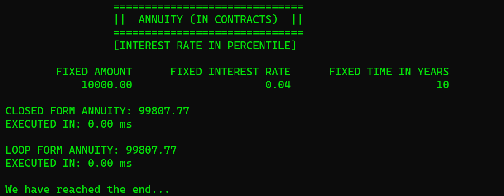

## 5. Calculating Growing Annuity (A sequence of Cash Flows for a given number of years, say T periods into the future, where each payment grows by a given factor each year) ##

Execute using:

&nbsp;&nbsp;&nbsp;&nbsp;&nbsp;&nbsp;&nbsp;&nbsp;&nbsp;&nbsp; `g++ -pedantic-errors -std=c++11 growingannuity.cpp -o growingannuity`

&nbsp;&nbsp;&nbsp;&nbsp;&nbsp;&nbsp;&nbsp;&nbsp;&nbsp;&nbsp; `./growingannuity 10000 6 3.5 10`

## ... Sample Output ... ##

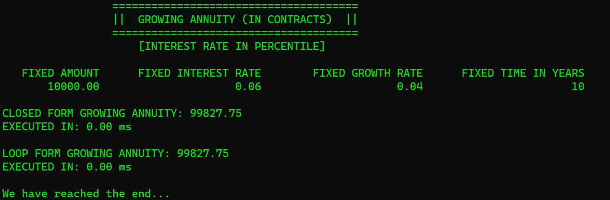

## 6. Estimating the Internal Rate of Return for a series of inputted Cash Flows

Execute using:

&nbsp;&nbsp;&nbsp;&nbsp;&nbsp;&nbsp;&nbsp;&nbsp;&nbsp;&nbsp; `g++ -pedantic-errors -std=c++11 internalrateofreturn.cpp -o iror`

&nbsp;&nbsp;&nbsp;&nbsp;&nbsp;&nbsp;&nbsp;&nbsp;&nbsp;&nbsp; `./iror -110 10 100`

## ... Sample Output ... ##

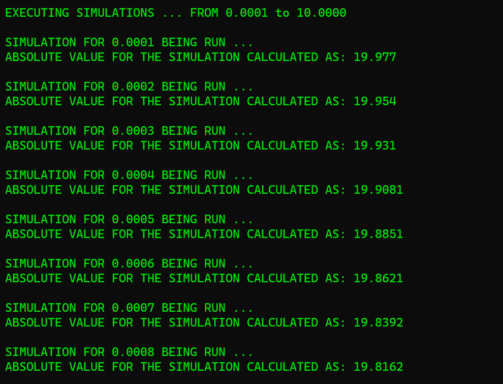

## ... ##

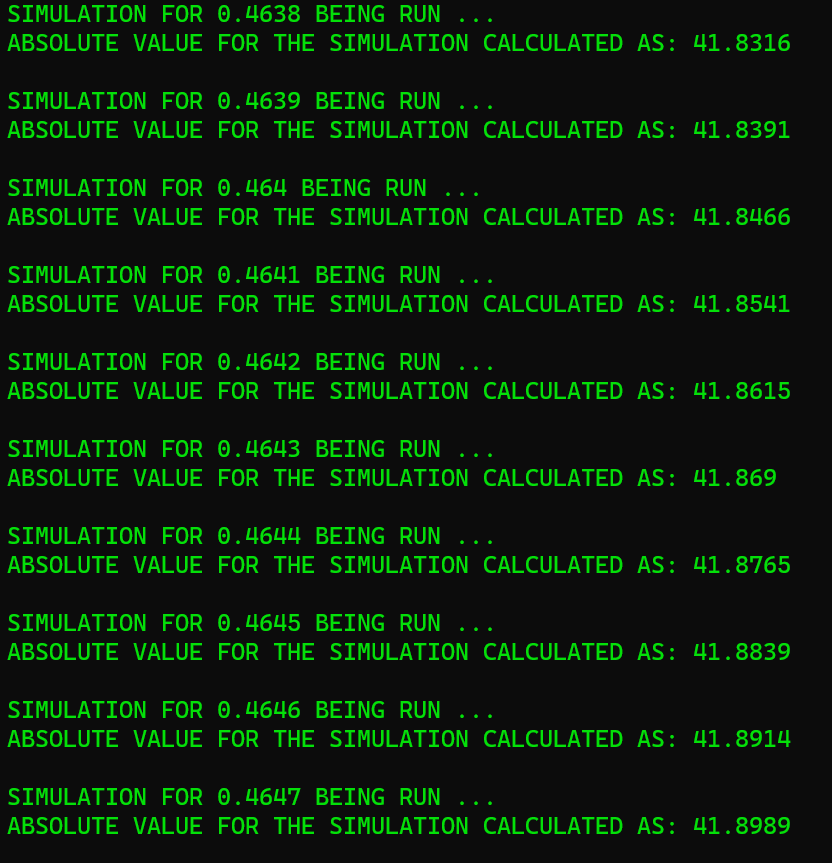

## ... ##

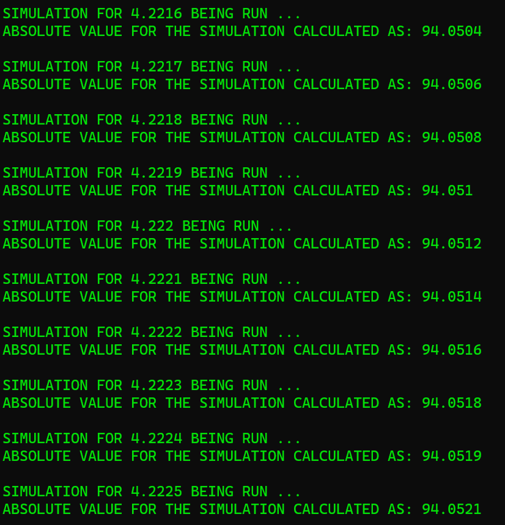

## ... ##

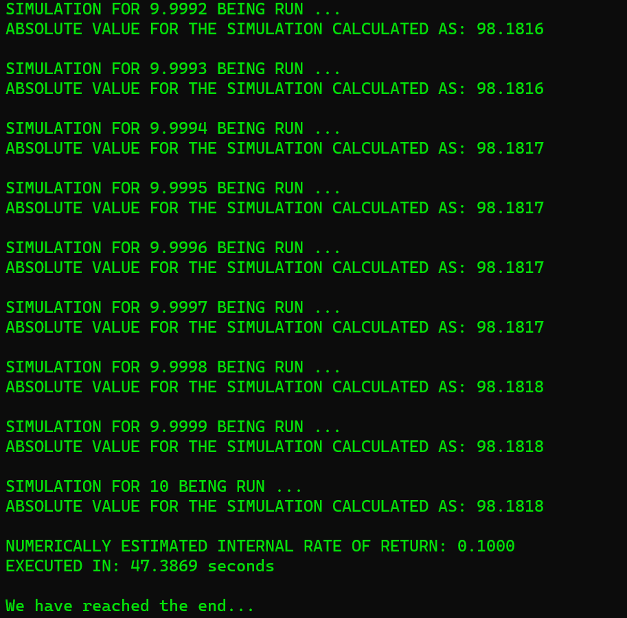

### ~~ Sankalok Sen ~~ ###
